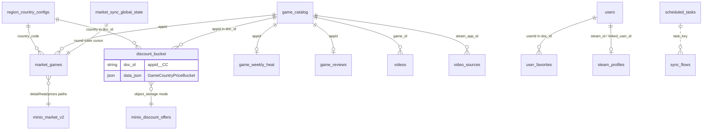
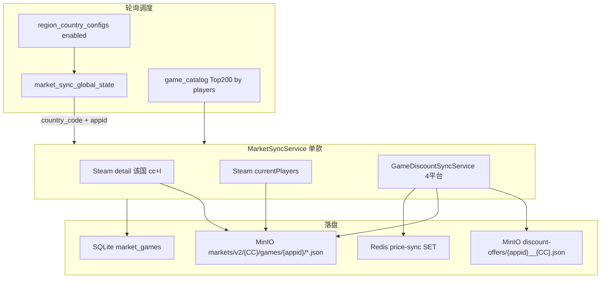

# SteamGame 数据模型 PRD（现状梳理）

> **目的**：梳理 Vultr 服务器上全部表结构、对象存储键、缓存索引及其业务逻辑关系，供后续重构时明确边界与依赖。  
> **范围**：`DATA_STORE=vultr_sqlite` 生产配置；Cloud Run 仅作计算层，**数据不落 GCP**。  
> **Schema 源文件**：`deploy/vultr/data-api/src/schema.sql`  
> **最后对齐代码**：2026-05-31

---

## 1. 存储分层总览

| 层级 | 技术 | 职责 | 是否权威数据源 |
|------|------|------|----------------|
| **L1 关系型元数据** | Vultr SQLite (`steam.db`) | 用户、国家配置、市场索引、游戏目录索引列 | 是（结构化查询 / Admin） |
| **L2 文档型 JSON 表** | Vultr SQLite（`data_json` 列） | 游戏详情、折扣桶（可选）、收藏、视频元数据 | 部分（大折扣 JSON 可迁 MinIO） |
| **L3 大对象** | Vultr MinIO (S3) | 折扣分桶 JSON、市场 v2 明细、公开榜单、视频文件 | 是（`object_storage` 模式下折扣权威） |
| **L4 性能缓存** | Vultr Redis | API 响应缓存、今日已同步 appid 索引 | 否（可重建） |

```
                    ┌─────────────────────────────────────┐
                    │         Cloud Run API               │
                    │  (无本地持久化，只读写下方存储)        │
                    └──────────┬────────────┬─────────────┘
                               │            │
              SQLITE_API_URL   │            │  S3_* / REDIS_URL
                               ▼            ▼
                    ┌──────────────┐  ┌──────────────┐
                    │ Vultr SQLite │  │ Vultr MinIO  │
                    │  :8090       │  │  :9000       │
                    │  steam.db    │  │  steamgame   │
                    └──────────────┘  └──────────────┘
                               │
                               ▼
                    ┌──────────────┐
                    │ Vultr Redis  │
                    │  :6379       │
                    └──────────────┘
```

**关键环境变量**

| 变量 | 生产值含义 |
|------|-----------|
| `DATA_STORE=vultr_sqlite` | 全部元数据走 SQLite data-api |
| `DISCOUNT_OFFERS_PERSISTENCE=object_storage` | 折扣大 JSON 只写 MinIO |
| `CACHE_UPLOAD_BACKEND=s3` | 公开缓存 / 市场 v2 写 MinIO |
| `SQLITE_API_URL` | 指向 Vultr data-api |
| `S3_*` | MinIO 连接 |
| `REDIS_URL` | Redis 连接 |

---

## 2. SQLite 表清单（22 张业务表 + 1 兜底表）

表分为四类：**配置与用户**、**国家与市场 v2**、**游戏域**、**视频与用户行为**、**运维与遗留**。

### 2.1 配置与用户

#### `users` — App 用户

| 列 | 类型 | 说明 |
|----|------|------|
| `id` | TEXT PK | 用户 UUID |
| `email`, `password_hash`, `display_name`, `avatar_url` | TEXT | 账号信息 |
| `auth_providers_json` | TEXT | OAuth 提供方列表 JSON |
| `steam_id` | TEXT | 绑定的 Steam ID（索引） |
| `steam_persona_name`, `steam_avatar`, `steam_profile_url` | TEXT | Steam 展示信息 |
| `disabled` | INTEGER | 0=正常 |
| `registered_at_ms`, `created_at_ms`, `updated_at_ms` | INTEGER | 时间戳 |

**逻辑关系**：`steam_id` ↔ `steam_profiles.steam_id`；`id` ↔ `user_favorites` 文档内 `userId`。

---

#### `config_discount_providers` — 折扣 API 密钥（单行 id=1）

| 列 | 说明 |
|----|------|
| `itad_api_key`, `gg_deals_api_key`, `steam_api_key` | 外部 API 密钥 |
| `itad_base_url`, `gg_deals_base_url`, `cheap_shark_base_url` | 各平台 Base URL |
| `steam_web_api_base_url`, `steam_store_base_url` | Steam API / Store |

**逻辑关系**：被 `GameDiscountSyncService`、`MarketSyncService` 读取；不关联其他表 FK。

---

#### `config_runtime` — 运行时 KV

| 列 | 说明 |
|----|------|
| `key` | TEXT PK |
| `value` | TEXT |

**用途**：零散开关/缓存；与业务表无固定 FK。

---

#### `scheduled_tasks_meta` — 定时任务元信息（单行 id=1）

仅 `created_at_ms` / `updated_at_ms`；实际任务列表在 `scheduled_tasks`。

---

#### `scheduled_tasks` — 定时任务定义

| 列 | 说明 |
|----|------|
| `id` | TEXT PK |
| `label` | 展示名 |
| `enabled` | 1=启用 |
| `task_key` | 处理器键（见 §5） |
| `timezone`, `frequency`, `time_of_day`, `every_hours` | Cron 规则 |
| `payload_json` | 任务参数 JSON |
| `last_run_at_ms`, `last_run_ok`, `last_run_summary`, `last_error` | 最近执行状态 |

**逻辑关系**：`task_key` 驱动 §5 各流水线；不直接 FK 到其他表。

---

### 2.2 国家配置（全局枢纽）

#### `region_country_configs` — 国家/地区映射

| 列 | 说明 |
|----|------|
| `country_code` | TEXT PK，业务 ISO2（如 `US`） |
| `country_name`, `native_name` | 展示名 |
| `steam_cc` | Steam Store 国家码 |
| `itad_country`, `gg_deals_region`, `cheapshark_country` | 各折扣源区域码 |
| `default_currency`, `currency_symbol` | 货币 |
| `steam_language`, `ui_language` | 语言 |
| `enabled`, `sort_order` | 是否启用、排序 |

**被引用方（逻辑 FK，无 SQL 约束）**：

- `market_games.country_code`
- `game_discount_offers` 文档 ID 后缀 `{appid}__{CC}`
- MinIO 路径中的 `{CC}`
- 所有按国同步任务的 region 解析入口

**设计要点**：全系统「业务国」以 `country_code` 为准；调用 Steam/ITAD/GG/CheapShark 时再映射到各 `*_cc` 字段。

---

### 2.3 市场 v2（分国 Top 200）

#### `market_games` — 分国游戏服务索引

| 列 | 说明 |
|----|------|
| `country_code`, `appid` | **复合 PK** |
| `name` | 展示名（应来自 `game_catalog.name`，非 Steam 区域化名） |
| `currency`, `currency_symbol` | 该国货币 |
| `current_players`, `discount_percent`, `final_price`, `heat_score` | 排序/列表用索引列 |
| `detail_synced_at_ms`, `price_synced_at_ms` | 同步时间 |
| `detail_json_path`, `heat_json_path`, `prices_json_path` | MinIO 对象键 |
| `data_json` | 内嵌 `{ priceSummary }` 等轻量字段 |

**逻辑关系**：

```
region_country_configs.country_code ──► market_games.country_code
game_catalog.appid ──────────────────► market_games.appid
MinIO detail/heat/prices.json ◄─────── path 列指向
game_discount_offers 桶 ─────────────► 经 sync 写入 prices.json + priceSummary
```

**MinIO 路径规则**（与 `*_json_path` 一致）：

| 文件 | 路径 |
|------|------|
| Steam 详情 | `cache/markets/v2/{CC}/games/{appid}/detail.json` |
| 热度 | `cache/markets/v2/{CC}/games/{appid}/heat.json` |
| 多平台价 | `cache/markets/v2/{CC}/games/{appid}/prices.json` |
| 国家榜单 | `cache/markets/v2/{CC}/lists/top-discounts.json` |
| 国家榜单 | `cache/markets/v2/{CC}/lists/top-heat.json` |

---

#### `market_sync_global_state` — 轮询同步状态（单行 id=1）

| 列 | 说明 |
|----|------|
| `country_queue_json` | 启用国家队列 JSON |
| `current_country_index`, `current_country_code` | 当前处理国 |
| `appid_cursor` | 该国 Top N 内的 appid 游标 |
| `last_run_at_ms`, `last_run_summary` | 最近批次摘要 |

**逻辑关系**：配合 `market_country_round_robin` 任务；队列来源为 `region_country_configs`（enabled=1）；候选 appid 来自 `game_catalog` 按 `current_players` 排序 Top N。

---

### 2.4 游戏域

#### `game_catalog` — 游戏主目录（全局，不按国）

| 列 | 说明 |
|----|------|
| `appid` | TEXT PK |
| `name` | 游戏名（**权威展示名**） |
| `detail_synced` | 是否已同步 Steam 详情 |
| `current_players`, `discount_percent` | 列表排序镜像列 |
| `last_detail_sync_at_ms` | 详情同步时间 |
| `data_json` | 完整 `GameCatalogDoc` JSON |
| `created_at_ms`, `updated_at_ms` | 时间戳 |

**`data_json` 主要字段**（`GameCatalogDoc`）：

- 媒体：`headerImage`, `screenshots`, `trailerUrls`, `trailerThumbnailUrls`
- 文案：`shortDescription`, `detailedDescription`, `developers`, `publishers`, `genres`, `tags`
- 价格镜像（全局 Steam US 等）：`priceInitial`, `priceFinal`, `discountPercent`
- 评论摘要：`reviewSummary`, `reviewCount`
- 状态：`detailUnavailable`, `isFree`, `lastMetaSyncedAt`

**逻辑关系**：几乎所有游戏相关表的 `appid` 均指向此表；**1 游戏 : N 国** 的价格在折扣桶，不在 catalog。

---

#### `game_reviews` — 评论聚合

| 列 | 说明 |
|----|------|
| `appid` | TEXT PK |
| `data_json` | 评论统计 JSON |
| `updated_at_ms` | 更新时间 |

**关系**：`appid` → `game_catalog.appid`；由 Steam catalog sync 写入。

---

#### `game_weekly_heat` — 周热度 / 在线人数历史

| 列 | 说明 |
|----|------|
| `appid` | TEXT PK |
| `data_json` | 含 `playersDaily[]` 等 |
| `updated_at_ms` | 更新时间 |

**关系**：`appid` → `game_catalog.appid`；同步任务会把 `currentPlayers` **镜像写回** `game_catalog.current_players`。

---

#### `game_discount_offers` — 分国折扣分桶（文档表）

| 列 | 说明 |
|----|------|
| `doc_id` | TEXT PK，格式 **`{appid}__{country_code}`** |
| `data_json` | `GameCountryPriceBucket` JSON |
| `updated_at_ms` | 更新时间 |

**`data_json` 结构**（`GameCountryPriceBucket`）：

```typescript
{
  countryCode: string;           // 业务国 ISO2
  steamCc, itadCountry, ggDealsRegion, cheapsharkCountry;
  steam?: RegionalSourcePriceSnapshot;      // Steam 店价
  isthereanydeal?: RegionalSourcePriceSnapshot;
  ggdeals?: RegionalSourcePriceSnapshot;
  cheapshark?: RegionalSourcePriceSnapshot;
  itadDetail?: ItadDetailSnapshot;          // 史低、历史价
  ggDetail?: GgDetailSnapshot;              // GG 官方 prices 块
  worthBuy?: WorthBuyStoredSnapshot;       // 值得买指数
  lastFullSyncAt?: timestamp;
}
```

**持久化模式**：

| `DISCOUNT_OFFERS_PERSISTENCE` | 权威存储 | SQLite 表 |
|-------------------------------|----------|-----------|
| `object_storage`（生产） | MinIO `cache/discount-offers/v1/{appid}__{CC}.json` | 通常为空或仅索引 |
| `firestore`（遗留） | SQLite/Firestore 行 | 有完整 `data_json` |

**逻辑关系**：

```
game_catalog.appid ──► doc_id 前缀
region_country_configs.country_code ──► doc_id 后缀
GameDealLinkRepository ──► 读桶扁平化为 deal 卡片（运行时，非独立表）
Redis price-sync SET ──► 同步成功后 SADD appid
```

---

#### `game_deal_links` — **遗留**，已废弃

| 列 | 说明 |
|----|------|
| `doc_id` | TEXT PK |
| `data_json` | 旧 deal 链接 |

**现状**：`GameDealLinkRepository` 从 `game_discount_offers` 桶**实时扁平化**；此表仅 cleanup 任务可能清理。新数据不应写入。

---

### 2.5 Steam 用户侧

#### `steam_profiles` — Steam 资料缓存

| 列 | 说明 |
|----|------|
| `steam_id` | TEXT PK |
| `persona_name`, `avatar`, `profile_url` 等 | Steam 资料 |
| `country_code` | 推断/设置的国家 |
| `linked_user_id` | → `users.id` |
| `last_fetched_at_ms` | 拉取时间 |

---

#### `steam_friends_cache` / `steam_owned_games_cache` / `steam_recent_games_cache`

| 表 | PK | 内容 |
|----|-----|------|
| `steam_friends_cache` | `owner_steam_id` | 好友列表 JSON |
| `steam_owned_games_cache` | `owner_steam_id` | 拥有游戏 JSON |
| `steam_recent_games_cache` | `owner_steam_id` | 最近游戏 JSON |

**关系**：`owner_steam_id` → `steam_profiles.steam_id` / `users.steam_id`。

---

#### `user_favorites` — 用户收藏

| 列 | 说明 |
|----|------|
| `doc_id` | TEXT PK，格式 **`{userId}_{appid}`** |
| `data_json` | `{ userId, appid, name, headerImage, ... }` |
| `updated_at_ms` | 更新时间 |

**关系**：`userId` → `users.id`；`appid` → `game_catalog.appid`。

---

#### `steam_sync_jobs` — Steam 同步任务队列

| 列 | 说明 |
|----|------|
| `doc_id` | TEXT PK |
| `data_json` | 任务状态 JSON |
| `updated_at_ms` | 更新时间 |

---

### 2.6 视频

#### `videos` — 视频元数据

| 列 | 说明 |
|----|------|
| `id` | TEXT PK |
| `game_id` | 关联 `game_catalog.appid`（索引） |
| `status`, `visibility` | 发布状态 |
| `data_json` | 完整视频文档 |
| `created_at_ms`, `updated_at_ms` | 时间戳 |

**MinIO**：`videos/{videoId}/master.mp4`, `vertical_9_16.mp4`, `thumbnail.jpg`

---

#### `video_jobs` — 转码任务

| 列 | 说明 |
|----|------|
| `id` | TEXT PK |
| `status` | 任务状态 |
| `data_json` | 含 `videoId` → `videos.id` |

---

#### `video_sources` — 视频源（Steam 预告片等）

| 列 | 说明 |
|----|------|
| `id` | TEXT PK |
| `steam_app_id` | → `game_catalog.appid` |
| `data_json` | 源 URL、Steam movie id 等 |

**流水线**：`steam_catalog_sync` → 读 catalog 预告片 → 创建 `video_sources` + `videos` → worker 转码上传 MinIO。

---

### 2.7 运维

#### `api_request_logs` — API 请求日志

| 列 | 说明 |
|----|------|
| `doc_id` | TEXT PK |
| `data_json` | 请求/响应摘要 |
| `updated_at_ms` | 时间 |

**默认关闭**（`REQUEST_LOG_ENABLED=false`）；`request_log_cleanup` 任务按保留天数删除。

---

#### `documents` — 未映射集合兜底（不应再写入）

| 列 | 说明 |
|----|------|
| `collection`, `doc_id` | 复合 PK |
| `data` | JSON 字符串 |
| `updated_at_ms` | 更新时间 |

Firestore 迁移遗留；新功能应使用专用表。

---

## 3. MinIO 对象键与 DB 行对照

| 对象键模式 | 对应 DB | 写入方 | 读取方 |
|------------|---------|--------|--------|
| `cache/discount-offers/v1/{appid}__{CC}.json` | 同 `game_discount_offers.doc_id` | `GameDiscountSyncService` | Deal 聚合、Admin、公开 API |
| `cache/markets/v2/{CC}/games/{appid}/detail.json` | `market_games.detail_json_path` | `MarketSyncService` | 分国详情 API |
| `cache/markets/v2/{CC}/games/{appid}/heat.json` | `market_games.heat_json_path` | `MarketSyncService` | 分国列表 |
| `cache/markets/v2/{CC}/games/{appid}/prices.json` | `market_games.prices_json_path` | `MarketSyncService` | Admin 分国市场页 |
| `cache/markets/v2/{CC}/lists/top-*.json` | 由 `market_games` 查询生成 | `market_build_lists` | 公开分国榜单 API |
| `cache/top-discounts-{cc}.json` 等 | 无直接行，聚合产物 | `build_public_cache` | App CDN 缓存 |
| `videos/{videoId}/*` | `videos.id` | Video worker | App 播放 |

---

## 4. Redis 键与 DB 对照

前缀：**`steamgame:v1:`** + 逻辑键

| 逻辑键 | 类型 | 数据来源 | TTL |
|--------|------|----------|-----|
| `public:v1:config:countries:body` | String | `region_country_configs` 全表 | ~600s |
| `games:catalog:v1:*` | String | `game_catalog` 分页 | ~600s |
| `games:search:v1:*` | String | `game_catalog` 搜索 | ~600s |
| `price-sync:{YYYY-MM-DD}:all` | SET | 成员=appid | 长期 |
| `price-sync:{YYYY-MM-DD}:{CC}` | SET | 成员=appid | 长期 |
| `price-sync:{YYYY-MM-DD}:{CC}:{source}` | SET | 成员=appid | 长期 |
| `price-sync:ever` | SET | 历史全部 appid | 长期 |

**写入时机**：折扣同步成功 → `recordPriceSync(appid, { countryCode, source })`。  
**重建**：Admin「重建 price-sync 索引」从 MinIO `cache/discount-offers/v1/*` LastModified 扫描。

---

## 5. 定时任务与数据流

| task_key | 读取 | 写入 | 说明 |
|----------|------|------|------|
| `steam_catalog_sync` | Steam API | `game_catalog`, `game_reviews`, `video_sources`, `videos` | 全局目录同步 |
| `market_country_round_robin` | `region_country_configs`, `game_catalog`, 外部价 API | `market_games`, MinIO market v2, 折扣桶, `market_sync_global_state` | 67 国轮询，每批 ~50 款 |
| `market_build_lists` | `market_games` | MinIO `lists/top-*.json` | 分国 Top 折扣/热度榜 |
| `build_public_cache` | `game_catalog`, 折扣桶 | MinIO `cache/*.json` | 旧版公开 CDN 快照 |
| `cleanup_invalid_deal_links` | `game_discount_offers` | 删除 invalid 字段/文档 | 仅 firestore 模式有意义 |
| `request_log_cleanup` | `api_request_logs` | DELETE 过期行 | 日志Retention |

**推荐执行顺序**（`SCHEDULED_TASK_RUN_ORDER`）：

```
steam_catalog_sync → market_country_round_robin → market_build_lists → build_public_cache
```

---

## 6. 核心实体关系图



> 注：SQLite **无 FOREIGN KEY**；上图为逻辑关系，由应用层通过 `appid` / `country_code` / `doc_id` 约定维护。

---

## 7. 主要业务流（端到端）

### 7.1 游戏入库（Catalog）

```
Steam Store API
    → steam_catalog_sync
    → game_catalog (appid, name, data_json)
    → game_reviews (可选)
    → video_sources + videos (预告片)
```

### 7.2 全球折扣同步（按 appid × 国）

```
region_country_configs (解析 steam_cc / itad / gg / cheapshark)
    → GameDiscountSyncService (4 平台 API)
    → MinIO cache/discount-offers/v1/{appid}__{CC}.json
    → Redis price-sync SET
    → GameDealLinkRepository 扁平化 (运行时)
```

### 7.3 分国市场 v2（Top 200 × 67 国）

**核心定位**：按**业务国**（`country_code`，如 `US`/`JP`）维护 Top 200 热门游戏；每款游戏在该国下，从 **4 个折扣平台** 分别拉取价格，写入 MinIO + `market_games` 索引。

#### 7.3.1 触发方式

| 入口 | 代码 | 说明 |
|------|------|------|
| 定时任务 | `market_country_round_robin` | 67 国轮询，每批默认 50 款 |
| Admin API | `POST /api/admin/markets/round-robin/run` | 手动跑一批 |
| Admin API | `POST /api/admin/markets/{CC}/games/{appid}/sync` | 单国单游戏强制同步 |
| 脚本 | `backfill-market-platform-prices.ts` | 本地/批量补全四平台价 |

#### 7.3.2 国家队列与候选游戏

```
region_country_configs (enabled=1, sort_order)
    → market_sync_global_state.country_queue_json
    → 当前国 current_country_code + appid_cursor

game_catalog ORDER BY current_players DESC
    → 取 Top N（默认 200）作为该国候选池
    → 游标 appid_cursor 顺序分批（每批 batchSize，默认 50）
    → 一国满 200 后切下一国
```

#### 7.3.3 单国单游戏同步三步（`MarketSyncService.syncGameMarket`）

对 `(country_code, appid)` 每次同步包含三条并行业务线：

| 步骤 | 内容 | 外部 API | 落盘 |
|------|------|----------|------|
| **Detail** | Steam 商店详情（描述、图、Steam 标价） | `store.steampowered.com/api/appdetails?cc=&l=` | MinIO `detail.json` |
| **Heat** | 当前在线人数 + 热度分 | Steam 玩家数 API | MinIO `heat.json` |
| **Prices** | **四平台折扣价** | 见 §7.3.4 | MinIO `prices.json` + 折扣桶 |

同步完成后 upsert `market_games` 行：`name` 优先 `game_catalog.name`；`priceSummary` 由四平台桶 + Steam detail 汇总。

#### 7.3.4 各国家 × 各平台 — 折扣价获取规则

**国家解析入口**（均读 `region_country_configs`）：

| 用途 | 方法 | 输出 |
|------|------|------|
| Steam 详情/店链 | `resolveForRegionalDetail(CC)` | `steamCc`, `steamLanguage`, `defaultCurrency`, `currencySymbol` |
| 四平台 API 参数 | `resolveDealProviderCodes(CC)` | `steamStoreCc`, `itadCountry`, `ggDealsRegion`, `cheapsharkCountry` |

> **术语**：`CC` = 业务国 ISO2（Admin/App 展示用）；各平台 API 使用映射后的 **Provider Region**，可能与 `CC` 不同（如业务国 `GB`，Steam `cc=gb`）。

**四平台默认顺序与 API**（`GameDiscountSyncService.syncAppDeals`）：

| 平台 | source 键 | 是否按国独立请求 | API / 参数 | 写入桶字段 | 购买链接 |
|------|-----------|------------------|------------|------------|----------|
| **Steam** | `steam` | ✅ 每国单独 | `appdetails?appids={id}&cc={steamStoreCc}&l={lang}` | `bucket.steam` | 区域 Steam 商店 URL |
| **GG.deals** | `ggdeals` | ✅ 每国单独 | `GET /v1/prices/by-steam-app-id/?ids={id}&region={ggDealsRegion}` | `bucket.ggdeals` + `ggDetail` | `gg.deals/game/...?region=` |
| **ITAD** | `isthereanydeal` | ✅ 每国单独 | `lookup/v1` → `games/prices/v3?country={itadCountry}` | `bucket.isthereanydeal` + `itadDetail` | **ITAD 游戏页**（非 Steam 跳转） |
| **CheapShark** | `cheapshark` | ⚠️ **一次抓取，多国复用** | `GET /games?steamAppId=` + `/deals?id=` | `bucket.cheapshark`（各国桶写相同参考价） | cheapshark redirect |

**API 密钥来源**：`config_discount_providers`（Admin Settings → ITAD / GG 密钥）。

**跳过策略**（`DEAL_SYNC_PRICE_DAY_TZ`，默认 `Asia/Shanghai`）：

- 同一 `(appid, CC, source)` 在**同一自然日**已成功同步 → 跳过 API，复用桶内数据（`skipped_same_calendar_day`）
- `forceRefresh=true`（Admin 单游戏同步）→ 强制重拉
- Steam 免费/零价游戏：**不再阻断** ITAD/GG/CheapShark，仍继续拉其他平台

#### 7.3.5 价格数据落盘（三层）

```
                    syncAppDeals(appid, { countries: [CC], sources: [4平台] })
                                    │
          ┌─────────────────────────┼─────────────────────────┐
          ▼                         ▼                         ▼
  MinIO 折扣桶（权威）        MinIO market prices.json    SQLite market_games
  cache/discount-offers/     cache/markets/v2/{CC}/       data_json.priceSummary
  v1/{appid}__{CC}.json      games/{appid}/prices.json   + 索引列 discount_percent
  GameCountryPriceBucket     MarketPricesDoc.bucket         final_price, currency_symbol
```

**`GameCountryPriceBucket` 结构**（键 `{appid}__{CC}`）：

```json
{
  "countryCode": "US",
  "steamCc": "us",
  "itadCountry": "US",
  "ggDealsRegion": "us",
  "cheapsharkCountry": "US",
  "steam": { "originalPrice", "finalPrice", "discountPercent", "currency", "url" },
  "isthereanydeal": { ... },
  "ggdeals": { ... },
  "cheapshark": { ... },
  "itadDetail": { "historyLow", "priceHistory", ... },
  "ggDetail": { "prices": { "currentRetail", "currentKeyshops", ... } },
  "worthBuy": { "score", ... }
}
```

**`priceSummary` 汇总规则**（`buildMarketGamePriceSummary`）：

- **列表主价**（`originalPrice` / `finalPrice` / `discountPercent`）：以 **Steam 该国价** 为准
- **四列平台价**：Admin「分国市场 v2」表格展示 `platforms.steam / isthereanydeal / ggdeals / cheapshark`
- Steam 价单位为**分**（minor units），展示时 ÷100（JPY/KRW 等整数货币除外）
- ITAD 链接若误存为 Steam URL → 自动替换为 `buildItadGamePageUrl(itadGameId)`

#### 7.3.6 端到端流程图



#### 7.3.7 与「全球折扣同步」的关系

| 维度 | 全球折扣（Deal Sync） | 分国市场 v2 |
|------|----------------------|-------------|
| 触发 | Admin Deal Sync / 旧批量任务 | `market_country_round_robin` |
| 游戏范围 | 指定 appid 列表或 catalog 子集 | 每国 Top 200 热度 |
| 国家范围 | 可多国一次 | **一次只处理当前轮询国** |
| 价格逻辑 | 同一 `syncAppDeals` | **复用同一 `syncAppDeals`** |
| 额外产出 | 仅折扣桶 + Redis | 折扣桶 + market MinIO + `market_games` |

> **结论**：分国市场 v2 的「各国家各平台折扣价」**不是独立价源**，而是对 `GameDiscountSyncService` 的封装调用；差异在于**按国轮询 Top 200** 并额外写 market 索引与 MinIO 副本。

### 7.4 公开 API 读路径

| API 场景 | 读存储 |
|----------|--------|
| 国家列表 | Redis → SQLite `region_country_configs` |
| 游戏搜索/列表 | Redis → SQLite `game_catalog` |
| 游戏详情（旧） | SQLite catalog + MinIO 折扣桶 |
| 分国市场列表 v2 | SQLite `market_games` + MinIO lists |
| 分国游戏详情 v2 | SQLite `market_games` + MinIO detail/prices |
| CDN 榜单（旧） | MinIO `cache/top-discounts-*.json` |

---

## 8. 现状问题与重构建议（供 PRD 迭代）

以下是从当前实现中提炼的**逻辑重叠/边界不清**点，便于你下一轮 PRD 重新划分：

### 8.1 三套「游戏列表」并存

| 体系 | 存储 | 维度 | 用途 |
|------|------|------|------|
| `game_catalog` | SQLite | 全球 | 搜索、Steam 同步、Top 玩家排序源 |
| `market_games` | SQLite + MinIO | 分国 Top 200 | v2 分国市场 Admin/App |
| `cache/*.json` | MinIO | 分国/全球快照 | 旧公开 CDN |

**建议**：明确 v2 为分国权威；`build_public_cache` 是否逐步下线或改为从 `market_games` 生成。

### 8.2 折扣数据双写路径

- 全局桶：`cache/discount-offers/v1/{appid}__{CC}.json`
- 市场副本：`cache/markets/v2/{CC}/games/{appid}/prices.json`

两者内容高度重叠。`market_games.data_json.priceSummary` 又是第三份 denormalized 摘要。

**建议**：定义单一权威（桶）+ 明确哪些层只做索引/缓存。

### 8.3 命名权威

- `game_catalog.name` = 目录原始名（不应被 Steam 区域化名覆盖）
- `market_games.name` = 应同步自 catalog，非 `detail.json` 里的 Steam 名

**建议**：PRD 中写死「展示名唯一来源 = catalog」。

### 8.4 无 SQL FK

所有关系靠约定；Admin/SQLite 页可改坏引用。

**建议**：重构时考虑 FK 或至少 DB 层 CHECK / 触发器文档。

### 8.5 遗留表

- `game_deal_links`、`documents` — 应标注只读/清理，禁止新写入
- Firestore Timestamp 类型在 JSON 中仍有历史残留 — 新写入应 plain ISO string

### 8.6 国家码 vs 平台码

业务国 `country_code`（US）与各 API 的 `steam_cc`/`itad_country` 等混用易错。

**建议**：PRD 层统一术语：**Business Country (BC)** vs **Provider Region (PR)**。

---

## 9. 表 → 模块 → Admin 页面对照

| SQLite 表 | 主要 Server 模块 | Admin 页面 |
|-----------|------------------|------------|
| `region_country_configs` | `region-country.repository` | 国家/Steam 配置 |
| `game_catalog` | `game-catalog.repository`, `steam-sync.worker` | 游戏数据 / Catalog Sync |
| `market_games` | `market-sync.service`, `market-round-robin.runner` | 分国市场 v2 |
| `game_discount_offers` / MinIO 桶 | `game-discount-sync.service`, `deal-sync-batch` | Deal Sync / 游戏详情价 |
| `scheduled_tasks` | `scheduled-tasks.runner` | 定时任务 |
| `videos` / `video_jobs` / `video_sources` | `video.worker`, `video-admin.service` | 视频管理 |
| `users` / `user_favorites` | auth, favorites API | 用户（如有） |
| 全部表 | `sqlite-db-admin.service` | SQLite 数据库管理 |
| MinIO / Redis | `infrastructure.service` | Settings → Infrastructure |

---

## 10. 附录：data-api 集合路由

Server 通过 Firestore 兼容 API 访问 SQLite 文档表（`deploy/vultr/data-api/src/collection-routing.ts`）：

| Firestore 集合名 | SQLite 表 | PK 列 |
|------------------|-----------|-------|
| `game_catalog` | `game_catalog` | `appid` |
| `game_reviews` | `game_reviews` | `appid` |
| `game_weekly_heat` | `game_weekly_heat` | `appid` |
| `videos` | `videos` | `id` |
| `video_jobs` | `video_jobs` | `id` |
| `video_sources` | `video_sources` | `id` |
| `user_favorites` | `user_favorites` | `doc_id` |
| `game_deal_links` | `game_deal_links` | `doc_id` |
| `game_discount_offers` | `game_discount_offers` | `doc_id` |
| `steam_sync_jobs` | `steam_sync_jobs` | `doc_id` |
| `api_request_logs` | `api_request_logs` | `doc_id` |
| 其他 | `documents` | `(collection, doc_id)` |

关系型表（`users`, `region_country_configs`, `market_games` 等）走 **relational store** 专用 API，不经集合路由。

---

## 11. 文档维护

| 变更类型 | 应同步更新 |
|----------|------------|
| 新增/删表 | `schema.sql`, 本文 §2, data-api routing |
| 新增 MinIO 前缀 | 本文 §3, `infrastructure.service.ts` DATA_PLACEMENT |
| 新增定时任务 | 本文 §5, `scheduled-tasks.repository.ts` |
| 折扣 JSON 字段 | `game-catalog.repository.ts` 类型 + 本文 §2.4 |

---

*本文档描述**当前生产实现**，非目标架构。下一轮 PRD 可基于 §8 问题清单重新定义域边界与单一数据源。*
